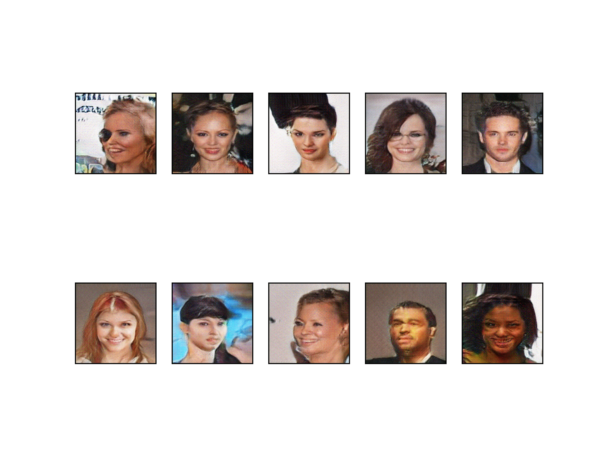

# Image Generator

# Description

This project implements WGAN-GP for image generation. WGANs are known for their stability and improved training dynamics compared to traditional GANs, and WGAN-GP improve WGAN by applying gradient penalty to replace weight clipping, making them well-suited for generating high-quality and diverse images. The project provides a comprehensive framework for training WGAN-GP models on custom datasets and generating synthetic images.

# WGAN-GP

The WGAN[1] apply wasserstein-1 distance as the loss metric of GAN to create more meaningful output comparing to other methods when measuring the distance between generated image distribution $\mathbb{P}\_\theta$  and real image distribution $\mathbb{P}\_r$. It could be difficult for JS divergence, which is the original GANs is related to, due to the reason that $\mathbb{P}\_\theta$  and $\mathbb{P}\_r$ might not have non-negatable intersection.

To further explain why $\mathbb{P}\_\theta$  and $\mathbb{P}\_r$ wouldn’t overlap:

1. Both $\mathbb{P}\_r$  and $\mathbb{P}\_{\theta}$ are low-dimension manifold in high dimension space, thus the overlap can be ignored.
2. Even though $\mathbb{P}\_r$ and $\mathbb{P}\_\theta$ have overlap, due to the reason that most training train in batch data for each step, if the sampling(batch size) is not large enough, it might still not overlap.

To further explain why Wasserstein distance is better for measuring distance than JS divergence if $\mathbb{P}\_\theta$ and $\mathbb{P}\_r$ doesn’t overlap:

- Wasserstein distance
    
    $
    W(\mathbb{P}\_r, \mathbb{P}\_\theta) = \underset{\gamma \in \prod(\mathbb{P}\_r, \mathbb{P}\_\theta)}{\text{inf}}\mathbb{E}\_{(x,y) \sim \gamma}{||x-y||}
    $
    
    where $\prod(\mathbb{P}\_r, \mathbb{P}\_\theta)$ is the set of all joint distributions $\gamma(x,y)$ whose marginals are respectively $\mathbb{P}\_r$ and $\mathbb{P}\_\theta$ and infimum(greatest lower bound) is taken over $\gamma(x,y)$. Expected value is calculate by the pairs $(x,y)$ sample from $\gamma$.
    
- JS divergence
    
    $
    JS(P\_r||P\_\theta) =\frac{1}{2} (KL(\mathbb{P}\_r||\mathbb{P}\_m) + KL(\mathbb{P}\_\theta||\mathbb{P}\_m))
    $
    
    Where $\mathbb{P}\_m$ is $(\mathbb{P}\_r + \mathbb{P}\_m)/2$ , this divergence is symmetric and always define because it could be set to $\mu = \mathbb{P}\_m$.
    
- The Kullback-Leibler(KL) divergence
    
    $
    KL(\mathbb{P}\_r||\mathbb{P}\_\theta) = \int \log(\frac{P\_r(x)}{P\_\theta(x)})P\_r(x)d\mu(x),
    $
    
- To further explain why Wasserstein distance is better when 2 distributions not overlapped, the example in WGAN[1] is used to explain. Let $Z\sim U[0,1]$ the uniform distribution on the unit interval. Let $\mathbb{P}\_0$ be the distribution of $(0,Z) \in \mathbb{R}^2$(a 0 on the x-axis and the random variable $Z$ on y-axis), uniform on a straight vertical line passing through the origin. Now let $g\_\theta(z) = (\theta, z)$ with $\theta$ a single real parameter. It is easy to see that in this case:
    - KL divergence:
        
        $
        KL(\mathbb{P}\_0|| \mathbb{P}\_\theta) = KL(\mathbb{P}\_\theta|| \mathbb{P}\_0) = \begin{cases} +\infty & \text{if } \theta \neq 0 \\ 0 &\text{if } \theta = 0 \end{cases}
        $
        
    - JS divergence:
        
        $
        JS(\mathbb{P}\_0,\mathbb{P}\_\theta) \begin{cases} \log 2 & \text{if }  \theta \neq 0 \\ 0 & \text{if } \theta =0\end{cases}
        $
        
    - Wasserstein distance:
        
        $
        W(\mathbb{P}\_0, \mathbb{P}\_\theta) = |\theta|
        $
        
    

It could be observed that as long as $\mathbb{P}\_r, \mathbb{P}\_\theta$ doesn’t overlap, in JS divergence, the value would always be $\log{2}$, which mean it doesn’t matter how far or how close $\mathbb{P}\_\theta$ is to $\mathbb{P}\_r$, as long as it doesn’t overlap, the distance would be $\log2$. In the meantime, Wasserstein distance reflect a more meaningful distance when 2 distributions doesn’t overlap.

To solve the converge problem of WGAN, WGAN-GP[2] proposed applying gradient penalty as a soft constraint to replace the weight clipping technique, which both of them aim to make WGAN-GP 1-Lipschitz function . By calculating the gradient between generated images and real images, it only enforce the space between generated image and real images, which is believe enough and proof help model to converge in the WGAN-GP paper[2]. 

# Installation

For installation, the project could be cloned using GitHub by either using https or SSH:

```bash
# Cloning the project using https
git clone https://github.com/TziYung/image_generator.git
# Cloning the project using ssh
git clone git@github.com:TziYung/image_generator.git
```

To install the required packages

```bash
pip install -r requirement.txt
```

# Usage

To execute it:

```bash
python main.py -d path_to_directory
```

### Parameter:

-d, —dir: The path of the directory where the images is stored.

-s, —size: The size of the image, default to 256 if the value not given.

-l, —latent_size: The size of latent, default to 100 if the value not given.

-b , —batch_size: The batch size while training, default to 32 if the value not given.

# Result

The below pictures is generated by the WGAN-GP after 200 epochs with size 128 * 128 of images from [http://mmlab.ie.cuhk.edu.hk/projects/CelebA.html](http://mmlab.ie.cuhk.edu.hk/projects/CelebA.html), the batch size is set to 128 and latent size is set to 100.



[1]  Arjovsky, Martin, Soumith Chintala, and Léon Bottou. "Wasserstein generative adversarial networks." *International conference on machine learning*. PMLR, 2017.

[2] Gulrajani, Ishaan, et al. "Improved training of wasserstein gans." *Advances in neural information processing systems* 30 (2017).
